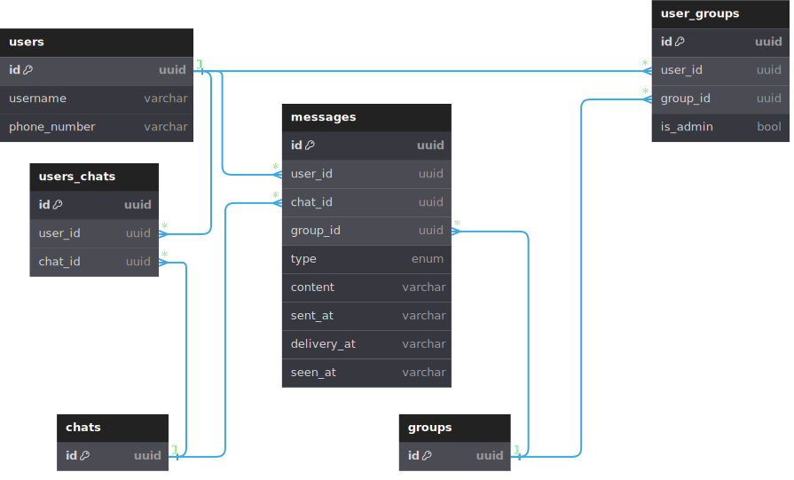

### Nama : Arief Mahendra

[link github](https://github.com/ariefmahendra/max-profit-test)

### Desain Database 
Buatlah DB Schema untuk basic chat messaging system dengan fitur : 
1. 1 on 1 messaging
2. Group messaging, di dalam group ada role : 
    1. Admin (yang bikin group, dan bisa menambah atau menghapus member)
   2. Member (yang di add admin ke dalam group, hanya bisa mengirim message)
3. Status (read/sent/pending)
4. Sharing images/files

1 nomor handphone digunakan untuk membuat 1 akun

Dibolehkan juga untuk menambahkan skenario/kondisi yang bisa ditambahkan ke dalam schema dari penjelasan diatas.

Anda bebas menentukan, boleh menggunakan SQL atau noSQL. Dan jelaskan kenapa anda memilih pilihan tersebut.

### Jawaban :

Pendekatan penggunaan jenis database : SQL 
1. Sistem yang dibuat bertujuan agar data lebih terstruktur.
2. Adanya relasi antar setiap entitas yang dibuat.

### Description : 

1. Tabel `users`: Menyimpan informasi tentang pengguna, termasuk `id` sebagai primary key, `username` untuk nama pengguna, dan `phone_number` yang unik untuk nomor telepon pengguna.

2. Tabel `groups`: Menyimpan informasi tentang grup, dengan `id` sebagai primary key.

3. Tabel `chats`: Menyimpan informasi tentang percakapan antara pengguna, dengan `id` sebagai primary key.

4. Tabel `user_groups`: Merupakan pivot table yang menghubungkan antara pengguna dan grup, dengan kolom `id` sebagai primary key, `user_id` sebagai foreign key yang merujuk ke `users.id`, `group_id` sebagai fyoreign ke yang merujuk ke `groups.id`, dan `is_admin` yang menandakan apakah pengguna adalah admin dari grup tersebut.

5. Tabel `users_chats`: Merupakan pivot table yang menghubungkan antara pengguna dan percakapan, dengan `id` sebagai primary key, `user_id` sebagai foreign key yang merujuk ke `users.id`, dan `chat_id` sebagai foreign key yang merujuk ke `chats.id`.

6. Tabel `messages`: Menyimpan informasi tentang pesan yang dikirim dalam percakapan, dengan `id` sebagai primary key, `user_id` sebagai foreign key yang merujuk ke `users.id`, `chat_id` sebagai foreign key yang merujuk ke `chats.id` yang menandakan percakapan di mana pesan dikirim, `group_id` sebagai foreign key yang merujuk ke `groups.id` yang menandakan grup di mana pesan dikirim, `type` untuk menandakan tipe pesan (misalnya, teks, gambar, atau file), `content` untuk isi pesan atau url sesuai dengan type yang dipilih, `sent_at` untuk waktu pengiriman pesan atau status pending, `delivery_at` merupakan waktu pesan telah terkirim atau status sent, dan `seen_at` merupakan waktu pesan dilihat oleh penerima atau status read. tipe data yang digunakan untuk waktu merupakan varchar bertujuan untuk mengatasi adanya perbedaan waktu pada pengguna, sehingga akan diimplementasikan menggunakan `Unix Epoch Time` yang lebih universal.

### Masalah

Anda diberikan array angka integer positif yang mewakili harga stok dalam beragam hari
(setiap index array mencerminkan hari yang berbeda) anda juga diberikan integer (i), yang
mewakili jumlah transaksi yang boleh dilakukan. Satu transaksi terdiri dari pembelian stok pada suatu hari dan menjualnya di kemudian hari.

Tulis sebuah fungsi yang menghasilkan keuntungan terbanyak yang dapat dilakukan melalui pembelian dan penjualan stok, bergantung dari (i) transaksi

`Note`: Anda hanya dapat memegang satu share stok pada satu saat; jadi anda tidak dapat
membeli lebih dari satu share stok pada hari manapun, dan anda tidak dapat membeli
sebuah share dari stok manapun kalau anda masih memegang share lain. Anda juga tidak perlu menggunakan semua sebuah (i) transaksi yang diperbolehkan.

### Example
`Input : ` i = 2, prices = [ 7, 1, 5, 3, 6, 4, 10 ]

`Output :` 11

`Explanation :` 
- Membeli pada hari ke 1 = `1` dan menjual pada hari ke 4 = `6` (6 - 1) = 5
- Membeli pada hari ke 5 = `4` dan menjual pada hari ke 6 = `10` (10 - 4) = 6
- Total profit dengan sejumlah i transaksi adalah `5 + 6 = 11`

[Code Solution](max_profit_test.go)

### Approach : 
1. Inisialiasi sebuah array profit yang berisikan buy and sell.
2. Pada hari ke 0, asumsikan kita akan melakukan buy dan belum ada transaksi, sehingga dapat disimpulkan untuk profit pembelian adalah  minus dan profit penjualan masih 0.
3. Kondisi harga beli transaksi ke 0: 
   - Kalau harga beli saat ini lebih rendah dari harga beli yang sudah ada, artinya kita akan menggunakan harga beli yang lebih rendah. 
   - Jika tidak maka akan tetap menggunakan harga beli yang sudah ada. 
4. Kondisi harga jual transaksi ke 0:
   - Kalkulasikan potensi keuntungan yang diperoleh misalkan menjual saham pada hari ini, jika harga lebih tinggi maka akan digunakan harga jual yang lebih tinggi, begitupun sebaliknya.
5. Kondisi transaksi 1 sampai k-1
   1. Memperbarui harga beli untuk transaksi setiap harinya.
      - Bandingkan keuntungan dari transaksi sebelumnya jika penjualan dan pembelian dilakukan pada hari ini.
      - pilih harga beli yang paling rendah.
   2. Memperbarui harga jual untuk transaksi setiap harinya.
      - Bandingkan keuntungan dengan menjual saham hari ini. 
      - Pilih potensi keuntungan yang paling tinggi, atau sebaliknya.
6. Keuntungan maksimum dapat diperoleh dari nilai penjualan transaksi terakhir yang dicapai oleh jumlah transaksi yang diperbolehkan.

| Iterasi | k    | prices[j] | profit[0].buy | profit[0].sell | profit[1].buy | profit[1].sell |
|---------|------|-----------|---------------|----------------|---------------|----------------|
| 1       | 0    | 7         | -7            | 0              | -7            | 0              |
| 2       | 1    | 1         | -1            | 0              | -1            | 0              |
| 3       | 2    | 5         | -1            | 4              | -1            | 4              |
| 4       | 3    | 3         | -1            | 4              | 1             | 4              |
| 5       | 4    | 6         | -1            | 5              | 1             | 7              |
| 6       | 5    | 4         | -1            | 5              | 1             | 7              |
| 7       | 6    | 10        | -1            | 9              | 1             | result = 11    |
